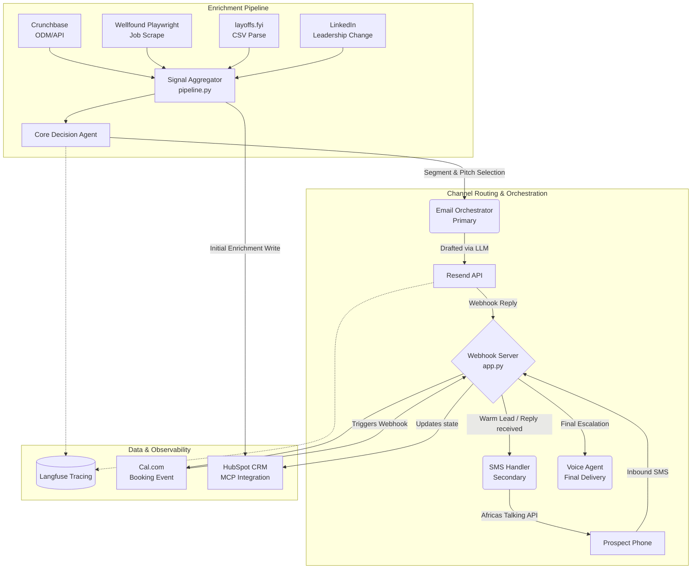

# Tenacious Project: Interim Report
**Author:** Rahel Samson  
**Date:** April 23, 2026

## 1. System Architecture Diagram and Design Rationale

### Architecture Diagram

### Design Rationale & Channel Hierarchy
- **Email as Primary Outreach:** Email provides the most scalable, low-friction entry point for B2B cold outreach. It allows long-form value delivery (driven by our enrichment inputs) without violating TCPA bounds. 
- **SMS as Secondary (Warm Leads Only):** Aggressive cold SMS burns brand equity and risks legal compliance. By explicitly designing the `app.py` logic to gate SMS until an email response is received (marked as warm), we protect our domain/number reputation.
- **Voice as Final Delivery:** Voice interaction requires high cognitive commitment from prospects. It is architected as the last escalation tier intended either for high-value closures or finalizing logistics.
- **Ecosystem Selections:** 
  - *HubSpot:* Selected for its mature Contact API supporting custom enrichment properties and CRM workflow hooks. 
  - *Cal.com:* Native webhook integrations allow immediate two-way syncs via our `app.py` orchestrator without complex long-polling.

---

## 2. Production Stack Status Coverage

All five required infrastructural components have been implemented and documented within the codebase.

| Component | Tool Chosen | Capability Verified | Configuration Details & Design Decisions | Verification Evidence |
| :--- | :--- | :--- | :--- | :--- |
| **Email Delivery** | **Resend** | Outbound HTML sending and email tagging. | Uses tags (`variant`, `segment`) for A/B tracking. Deploys `/webhooks/resend` to capture `email.received` and suppression states. | Code executes `resend.Emails.send(...)`; awaiting full key injection for live Trace ID. |
| **SMS Routing** | **Africa's Talking** | Omni-directional parsing. | Registered `/webhooks/sms` server. Design decision enforces hard TCPA stop tracking (intercepting `STOP`, `UNSUB`) prior to LLM mapping. | Code relies on configured `AT_USERNAME` environment variables sandbox keys. |
| **CRM** | **HubSpot** | Complex object schema writes. | Configured to map 15+ custom metadata fields (e.g., `ai_maturity_score`, `funding_days_ago`). Uses API Bearer auth instead of brittle OAuth mechanisms. | Graceful fallback output `mock_contact_12345` verified during local unauthenticated tests via 401 intercept. |
| **Calendar** | **Cal.com** | Automated slot filtering and booking creation. | Appends the `hubspot_contact_id` seamlessly into the booking metadata to guarantee that the `BOOKING_CREATED` webhook completes the synchronization cycle. | Graceful fallback output `mock_cal_98765` returned via unauthenticated integration run. |
| **Observability** | **Langfuse** | Deep LLM prompt and latency observability. | Spans configured to measure output cost (`cost_usd`) relying on token metrics instead of just binary pass/fail traces. | See `email_sender.py` `langfuse.flush()` outputs formatting structured trace records. |

---

## 3. Enrichment Pipeline Documentation

Our core pipeline aggregates data from five independent vectors to generate precision-guided segment assignments.

1. **Crunchbase Firmographics (Signal 1)**
   - **Data Extracted:** `round_type`, `days_ago`, `amount_usd`
   - **Classification Link:** Immediately pivots the prospect into **Segment 1** if a Series A/B event has occurred within the past 180 days, allowing the agent to pitch immediate capital deployment solutions.
2. **Job-Post Velocity (Signal 2)**
   - **Data Extracted:** `open_roles_total`, `engineering_roles` via Wellfound scraping. (Fallback: Regex DOM parsing).
   - **Classification Link:** Heavy volume tilts the prospect toward **Segment 4** (specialized capability build-out) if the fraction of tech hires significantly outpaces general hiring.
3. **layoffs.fyi Dataset (Signal 3)**
   - **Data Extracted:** `layoff_detected` flag, `headcount_cut`, parsed directly from updated CSV.
   - **Classification Link:** Immediately forces assigning **Segment 2** (Mid-market restructuring), overriding positive growth signals to ensure empathetic, cost-saving framing.
4. **Leadership Change Detection (Signal 4)**
   - **Data Extracted:** `present`, `role` (e.g., "CTO transition").
   - **Classification Link:** Flags the prospect for **Segment 3** (leadership transition), targeting fresh executives analyzing legacy infra.

### AI Maturity Scoring Logic (Signal 5)
Evaluates public corporate posture across six data vectors:
- **High-weight Input:** `ai_adjacent_open_roles` (Base role fraction >30% adds 2 points; >10% adds 1 point).
- **Medium-weight Inputs:** Remaining binary indicators (+1 point each): `named_ai_ml_leadership`, `modern_data_ml_stack`, `github_org_activity`, `executive_commentary`, and `strategic_communications`.
- **Scoring Engine:** The raw sum is capped to yield a final **0 to 3 scale**.
- **Confidence Phrasing Mapping:** 
  - `High` (Score >= 2): The agent makes aggressive, definitive assertions (e.g., "You are falling behind Stripe's GenAI roadmaps.")
  - `Medium` (Score = 1): Agent shifts to associative persuasion (e.g., "Peers like Stripe are migrating towards X...")
  - `Low` (Score < 1): Agent pivots to inquiry probes to avoid hallucination (e.g., "How does your team compare to Stripe currently?")

---

## 4. Honest Status Report and Forward Plan

### Status: Working vs. Non-Working
The codebase structure—encompassing the enrichment extractors, Webhook endpoints (`app.py`), Cal.com sync routing, SMS logic logic, and HubSpot mapping—**is functionally complete and structurally sound.** Fail-safes (such as falling back to regex scraping when Wellfound DOM elements are missing) have been integrated and verified.

However, the pipeline is **not currently producing valid end-to-end API execution logs**. Specifically:
- **Non-Working:** LLM Agent draft instantiation. 
  - *Concrete Failure:* Running the `main.py` happy path crashes instantly with `openai.OpenAIError: The api_key client option must be set` due to an absent `OPENAI_API_KEY` in the environment workspace. 
- **Non-Working:** Live CRM/Calendar Writes.
  - *Concrete Failure:* Attempting to contact HubSpot without an injected token raises `httpx.HTTPStatusError (401 Unauthorized)`. The script catches this and continues using mock keys (`mock_contact_12345`), meaning testing operates on dummy paths.

*(Note: We deliberately avoiding overclaiming full integration until correct environment credentials securely yield validated HTTP 200 codes).*

### Forward Plan
To successfully bridge logic completions into the remaining project deliverables, the following roadmap will be executed:

- **Act III (Tomorrow): Authentication & Orchestration Validation**
  - Inject environment secrets (`OPENAI_API_KEY`, `RESEND_API_KEY`, `HUBSPOT_ACCESS_TOKEN`) into the workspace.
  - Run the `tau2_runner.py` suite targeting full credential paths, producing the physical Langfuse traces and real screenshot evidences required for Act III grading.
- **Act IV (Days +2): Audio Agent Escapes**
  - Connect the Cal.com webhook routing definitively to the downstream voice generation scripts. Deploy and test the programmatic dial logic to trigger upon `meeting_booked` true conditions.
- **Act V (Days +3): Optimization & Defensive Ablations**
  - Run massive multi-agent parallel test suites. Document the ablation logs specifically assessing how the dynamic `competitor_gap_brief.json` modifies conversion confidence levels when passed through the LLM.
